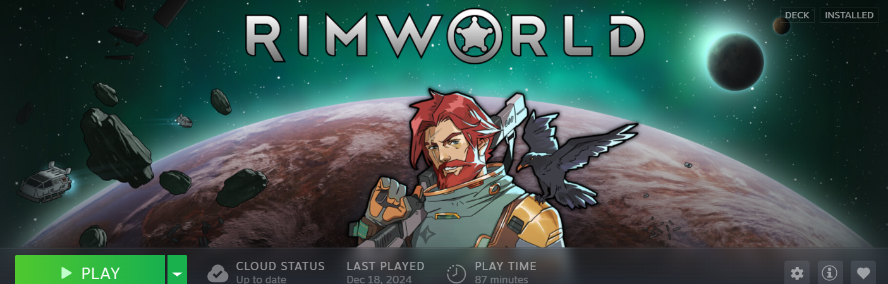
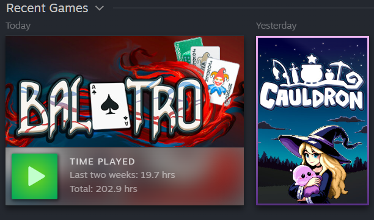
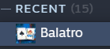

# Images

There are five different images that Steam uses for games. The hero, logo, cover, and banner images are all defined by a conventional location in the filesystem and, to my knowledge, the path where Steam looks for them can't be changed. However, the icon image path is stored in `shortcuts.vdf`.

Steam supports multiple image formats--at the very least, png and jpg. I'm not sure how Steam decides which image to use if there are multiple matches, e.g. `1234567890_hero.png` and `1234567890_hero.jpg`. As such, when using `nonsteam` to update images, it will erase all matching images and replace them with the one specified.

## Hero
> 
- **Dimensions**: 1920x620
- **File location**: `{steam_dir}/userdata/{user_id}/config/grid/{game_id}_hero.{ext}`
- **UI update method**: In desktop mode, right-click the hero and select "Set Custom Background"
- **Manual update method**: Replace/modify the file
- **`nonsteam` update method**: `nonsteam edit --image-hero <file>`

The background image for the hero at the top of the game details in desktop mode. It frequently does _not_ include the game's logo. That's a separate image asset.

## Logo
- **Dimensions**: variable
- **File location**: `{steam_dir}/userdata/{user_id}/config/grid/{game_id}_logo.{ext}`
- **UI update method**: In desktop mode, right-click the hero and select "Set Custom Logo"
- **Manual update method**: Replace/modify the file
- **`nonsteam` update method**: `nonsteam edit --image-logo <file>`

The logo that is overlaid onto the hero image in the example above. It's usually transparent.

The logo can also have its position modified by right-clicking and selecting "Adjust Logo Position". I don't know where this config value is stored or how to update it by hand.

## Cover

- **Dimensions**: 600x900
- **File location**: `{steam_dir}/userdata/{user_id}/config/grid/{game_id}p.{ext}`
- **UI update method**: In desktop mode, right-click the cover and select "Manage -> "Set custom artwork"
- **Manual update method**: Replace/modify the file
- **`nonsteam` update method**: `nonsteam edit --image-cover <file>`

The vertical card image used for game grids like "Recent Games", as in Cauldron above.

## Banner
- **Dimensions**: 600x900
- **File location**: `{steam_dir}/userdata/{user_id}/config/grid/{game_id}p.{ext}`
- **UI update method**: In desktop mode, right-click the banner and select "Manage -> "Set custom artwork"
- **Manual update method**: Replace/modify the file
- **`nonsteam` update method**: `nonsteam edit --image-banner <file>`

Not to be confused with the hero. The horizontal version of the cover, as in Balatro above. This is used to accentuate the first item in a game grid, e.g. the latest game in "Recent Games" and the most popular game in "Play Next".

## Icon
- **Dimensions**: 256x256
- **File location**: variable, but by conventional `{steam_dir}/userdata/{user_id}/config/grid/{game_id}_icon.{ext}`
- **UI update method**: Only available for non-Steam games, to my knowledge. Right-click, "Properties" -> "Shortcut" -> click icon
- **Manual update method**: Replace/modify the file, or modify `shortcuts.vdf` to point to a new file location
- **`nonsteam` update method**: To modify the entry in `shortcuts.vdf`, use `nonsteam edit --icon <file>`. To replace the file in its conventional location, use `nonsteam edit --image-icon <file>`

The icon in the desktop library game list. Not used in big picture, as far as I can tell.

This one is special, since it's the only image whose path is stored in `shortcuts.vdf`. When you set an icon image through Steam, it will copy that image to the conventional location and modify `shortcuts.vdf` to point to it, if it's not already set.

For the most part, you can treat this image like the others. Using `nonsteam edit --image-icon <file>` will put the image in the conventional location and update `shortcuts.vdf` to point to it. Unless you're doing something esoteric, this is the only command you should need. To only modify the value in `shortcuts.vdf`, us `nonsteam --icon <file>`.
